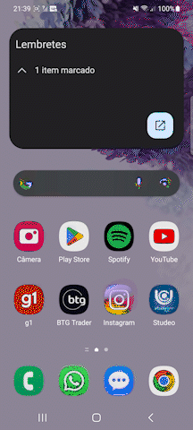
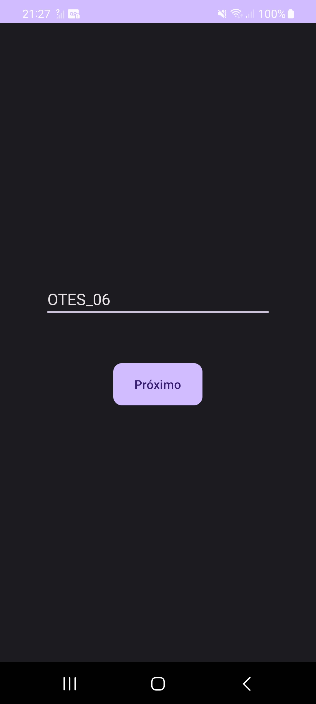
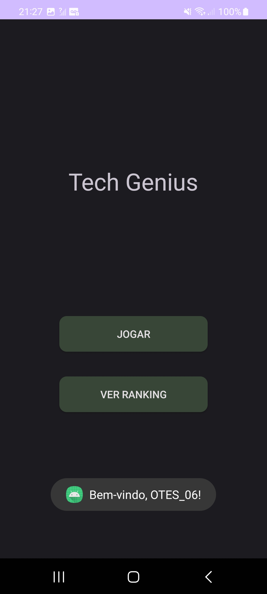
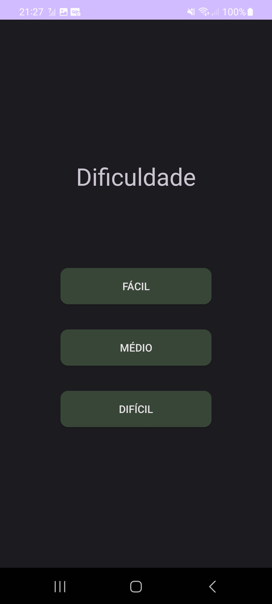
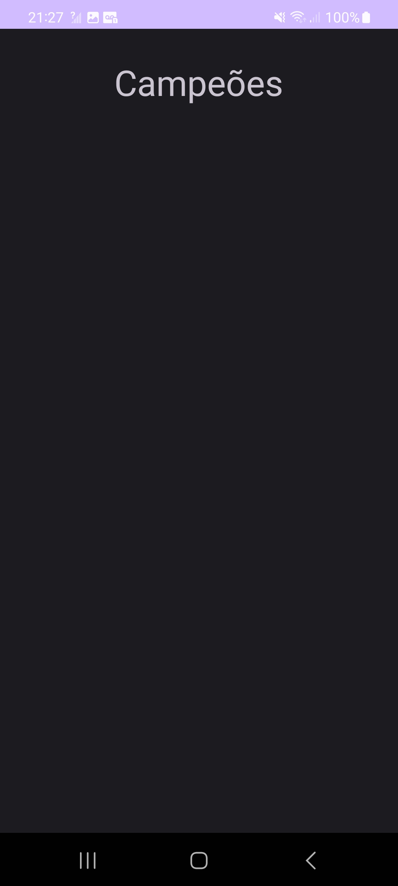
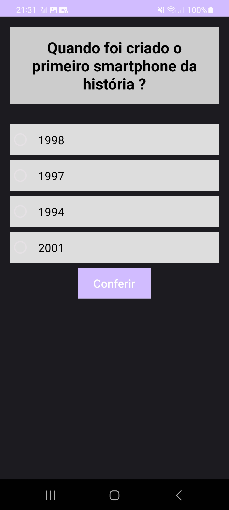
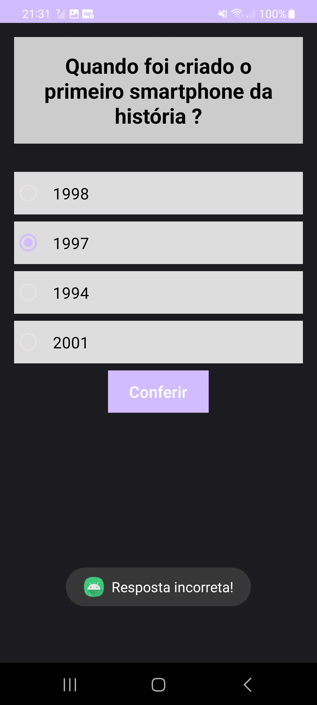
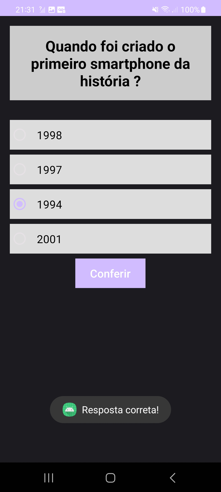

# Relatório Tech Genius

## Introdução

O objetivo deste relatório, é apresentar informações relevantes sobre o projeto desenvolvido para a disciplina Programação para Dispositivos Móveis, ministrada pelo professor Allan Rodrigo Leite. 

O projeto tem como objetivo, criar uma aplicação mobile com foco educacional, na área da computação. O aplicativo funciona como uma espécie de quiz, na qual, o jogador pode potencializar e aprimorar seus conhecimentos na área da tecnologia da informação. Com diferentes níveis, e funcionalidades, o APP possui diversas funções, buscando o maior nível de diversão e desafio para o jogador, procurando deixar o usuário o mais engajado possivel.

## Visão Geral

O projeto foi desenvolvido utilizando a linguagem de programação Java (versão 17) tanto no backend quanto no frontend e o framework Spring (versão 3.1.1). A aplicação web, que consiste em uma API REST, permite que o usuários crie seus jogador, além de visualizar uma lista de perguntas e respostas, usadas no jogo, além de resgatar jogadores e pontuação para rankear os que obtiveram mais pontuação.

Para o desenvolvimento das telas de interação (Actions), foi utilizado todo o conhecimento adquirido em sala de aula, e para melhorar a prática e conhecimento, foram desenvolvidas de diferentes modos. Um deles é através de código e outro é utilizando XML, assim como vimos durante as aulas.

O projeto utiliza o Spring MVC para o controle das requisições HTTP, o Spring Data JPA para a persistência dos dados e o PostgreSQL como banco de dados sql.

## Funcionalidades Implementadas

O projeto possui as seguintes funcionalidades:

1. Cadastro do usuário: os usuários podem criar seu jogador, informando o nome.

2. Escolha da dificuldade: os usuários podem escolher entre os níveis, fácil, moderado e difícil.

3. Listagem de Perguntas: as perguntas já são préviamente cadastradas e são exibidas aleatóriamente, uma por vez para o usuário em um total de 20 escolhidas entre as 30 possiveis.

4. É possível visualizar um ranking com a pontuação de cada usuário

## Arquitetura do Backend

O projeto segue a arquitetura MVC (Model-View-Controller) do Spring. A estrutura de diretórios é organizada da seguinte forma:

- `src/main/java`: contém as classes Java do projeto.
  - `com.api.techgenius`: pacote principal do projeto.
    - `controller`: contém as classes responsáveis por receber as requisições HTTP e controlar o fluxo da aplicação.
    - `model`: contém as classes de modelo que representam as entidades do sistema.
    - `repository`: contém as interfaces e classes de repositório que permitem o acesso aos dados.
    - `service`: contém as classes de serviço que implementam a lógica de negócio.
    - `dto`: contém as classes intermediária do banco e da aplicação.

## Informações para Execução

Para executar o projeto, é necessário ter instalado em sua máquina:

- Java Development Kit (JDK) versão 17 ou superior
- Apache Maven versão 3.6.3 ou superior
- PostgreSQL versão 15.3 ou superior
- Spring (versão 3.1.1)

Siga as etapas abaixo para executar o projeto:

1. Crie um novo banco de dados com o nome tech_genius_db na porta 5432 (Se desejar, mude nas configurações do projeto o nome e a porta)

2. Coloque usuário e senha de acesso como postgres (Se desejar, mude nas configurações do projeto api\src\main\resources\application.properties)

3. Clone o repositório do projeto para sua máquina local.

4. Abra a pasta api e execute o projeto para deixar online a API REST.

5. Abra a pasta otes06intent como novo projeto no Android Studio e espere o java reconhecer e baixar os pacotes necessários.

6. Clique no botão ( Run ) que aparece a cima da função main; 

7. Caso deseje, acesse a aplicação REST em seu navegador web através da seguinte URL: `http://localhost:8080`.

## Considerações Finais

O projeto desenvolvido, com a utilização de diversos recursos como framework, linguagem java, arquitetura, tecnologias como, Spring MVC, Spring Data JPA, Postgres e Android Nativo, foram um grande desafio e a experiência teve grande efeito, para melhorar e aprimorar nossos conhecimentos em relação ao desenvolvimento mobile e sobre outros, como o desenvolvimento de API, arquitetura e banco de dados. As funcionalidades implementadas permitem aos usuários criar o seu jogador, além de visualizar uma lista das perguntas existentes. O projeto segue a arquitetura MVC e utiliza boas práticas de desenvolvimento.

## Próximos Passos

Algumas melhorias e funcionalidades que futuramente podem ser implementadas no projeto são:

1. Adicionar autenticação e senha de usuários para garantir a segurança da aplicação.
2. Implementar mais perguntas e respostas.
3. Adicionar filtros de busca, para permitir o jogador, especificar somente os assuntos desejados.
4. Melhorar a interface do usuário com animações, gamificação e recompensas.

## MVP

### Página de login

### Página Inicial

### Página de Dificuldade

### Página Ranking

### Página Quiz

